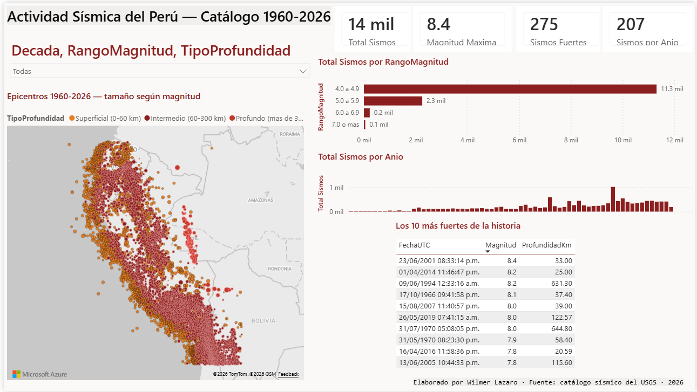
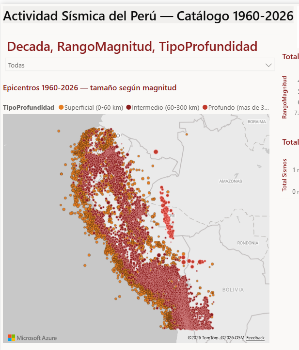
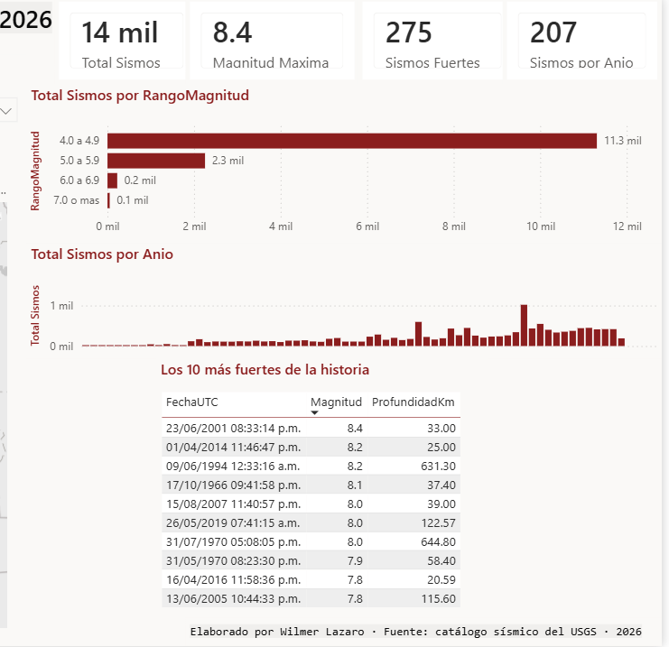
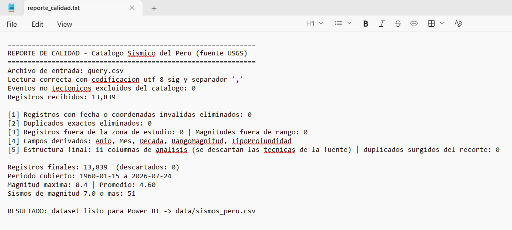

# 🌎 Actividad Sísmica del Perú — 66 años de datos en un dashboard

Proyecto de analítica sobre **datos reales**: 13,839 sismos de magnitud 4.0 o superior registrados en el territorio peruano y sus franjas fronterizas entre enero de 1960 y julio de 2026, obtenidos de la API pública del USGS (Servicio Geológico de los Estados Unidos), procesados con un pipeline de control de calidad en Python y visualizados en un dashboard de Power BI con mapa georreferenciado.

> 🎯 **Lo que este proyecto demuestra:** consumo de una API pública internacional, preparación y validación de datos reales con Python y pandas, así como visualización geoespacial y medidas DAX en Power BI.



| Mapa sísmico | Modelo de datos | Control de calidad |
|---|---|---|
|  |  |  |

📥 **[Descargar el dashboard (.pbix)](powerbi/dashboard_sismos_peru.pbix)** para explorarlo en Power BI Desktop.

## 🧩 La pregunta

El Perú vive sobre la zona de subducción entre las placas de Nazca y Sudamericana, de modo que los sismos forman parte de la vida nacional, aunque rara vez los vemos juntos en una sola vista que permita dimensionar su frecuencia, su ubicación y su verdadera escala a lo largo de las décadas.

## ⚙️ La solución

| Etapa | Herramienta | Archivo |
|---|---|---|
| 1. Descarga del catálogo desde la API del USGS filtrando la zona del Perú (1960 a la fecha, magnitud 4.0+) | API REST | ver "Cómo reproducirlo" |
| 2. **Preparación y control de calidad**: normalización de columnas, validación de coordenadas y magnitudes, exclusión de eventos no tectónicos y campos derivados para el análisis, junto a su reporte de auditoría | Python (pandas) | [`scripts/preparar_datos.py`](scripts/preparar_datos.py) |
| 3. Dashboard con mapa georreferenciado, evolución anual, distribución por magnitud y profundidad, además del Top 10 histórico | Power BI + DAX | [`powerbi/GUIA-CONSTRUCCION.md`](powerbi/GUIA-CONSTRUCCION.md) |

### 🔍 Resultado del control de calidad ([reporte completo](docs/reporte_calidad.txt))

```
Registros recibidos: 13,839
Eventos no tectonicos excluidos: 0
Duplicados, coordenadas o magnitudes invalidas: 0
Periodo cubierto: 1960-01-15 a 2026-07-24
Magnitud maxima: 8.4 | Sismos de magnitud 7.0 o mas: 51
```

## 🚀 Cómo reproducirlo

```bash
# 1. Descargar el catalogo desde la API del USGS (se guarda como query.csv en data/raw/)
#    https://earthquake.usgs.gov/fdsnws/event/1/query?format=csv&starttime=1960-01-01&endtime=2026-07-26&minlatitude=-21&maxlatitude=1&minlongitude=-84&maxlongitude=-66&minmagnitude=4&orderby=time-asc

# 2. Ejecutar la preparacion junto al reporte de calidad
python scripts/preparar_datos.py

# 3. Abrir Power BI Desktop e importar data/sismos_peru.csv
#    siguiendo powerbi/GUIA-CONSTRUCCION.md (medidas DAX y mapa incluidos)
```

Requisitos: Python 3.10 o superior con `pandas`, además de Power BI Desktop, que es gratuito.

## 📈 Hallazgos del análisis

- El catálogo registra **cerca de 210 sismos de magnitud 4.0+ por año**, mientras que los de magnitud 7.0 o superior suman 51 en todo el periodo, es decir, casi uno cada año y medio.
- **Los gigantes de la serie:** Atico, Arequipa 2001 (8.4), Paramonga 1966 (8.1), Pisco 2007 (8.0), el sismo profundo de Loreto 2019 (8.0 a 122 km) y Chimbote 1970 (7.9), este último el más letal de la historia peruana.
- La actividad se reparte casi por igual entre sismos **superficiales** (0-60 km, los más destructivos por su cercanía) e **intermedios** (60-300 km), mientras que los profundos de más de 300 km son apenas 148 y se concentran en la frontera con Bolivia y Brasil.
- Los registros crecen década a década, desde 145 en los años sesenta hasta 4,168 en la del 2010, lo cual refleja la mejora de la capacidad instrumental de detección antes que un aumento real de la sismicidad — distinción que todo análisis honesto debe señalar.
- El año con más registros es **2014** (1,019 eventos), impulsado por la secuencia de réplicas del terremoto de Iquique, dado que la zona de estudio incluye las franjas fronterizas con Chile y Ecuador.

## 👤 Autor

**Wilmer Jelko Lazaro Guerra** — Analista de Datos y QA con 7 años de experiencia en TI para los sectores de seguros, banca y telecomunicaciones, además de un MBA en Business Intelligence y Big Data.

📧 wilmer.lazaro.g@uni.pe · Lima, Perú

---

*Fuente de los datos: [USGS Earthquake Catalog](https://earthquake.usgs.gov/earthquakes/search/), API pública de acceso libre. El procesamiento y las conclusiones son propios.*

## 🇬🇧 English summary

Analytics project built on real data: 13,839 magnitude 4.0+ earthquakes recorded in Peru and its border areas between 1960 and 2026, pulled from the public USGS API, validated through a Python data-quality pipeline and visualized in a Power BI dashboard featuring a georeferenced map, decade trends, magnitude and depth distributions, plus the historical Top 10 — all standing on the same principle that guides my work: every chart must rest on complete, validated data.
